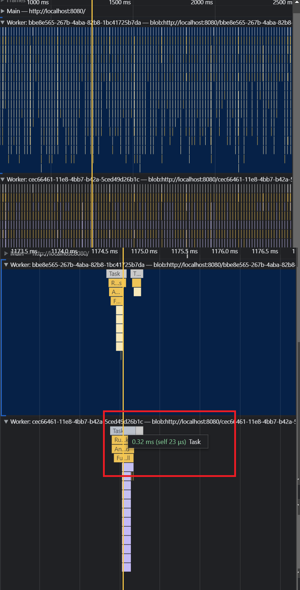

# physics_test
Rapier3D + BablyonJS test

BabylonJS for rendering. Rapier3D for scene collision and scripting interactions. All entities are physics-based and update the render thread.

Physics thread relays through a crowd navigation and dynamic nav mesh thread to enable AI behaviors.

BabylonJS thread handles only the render updating while positions and states etc. are determined by the AI and physics threads. 

Main thread just passes user inputs to babylonjs to update the render with simple vector calc.

### To run:

First ensure the navmesh worker is built with with `npm start`

Then after you can just do:

`tinybuild`

`npm i -g tinybuild & tinybuild` if you don't have [tinybuild](https://github.com/brainsatplay/tinybuild) installed.

### About
Rapier3D: fancy Rust -> JS WASM physics engine, it's faster than anything else free.

Benchmarks: https://www.dimforge.com/blog/2020/08/25/announcing-the-rapier-physics-engine/

BabylonJS: fancy JS rendering engine, including lots of extras. Little fatter than ThreeJS but heavier on game engine features.

The app with BabylonJS is about 6.1MB in size in our current bundler settings, not sure why it's so huge.

With ThreeJS the app is about 2MB, so the physics engine itself is <1MB bundled, since Three comes out to about 1MB by itself. Pretty freakin small though.

### TODO

- Proper AI controls e.g. targeting, snappier impulses
    -- independent targeting, states, etc (easy shit)
    -- Use boid grouping behaviors for idle state, cast each AI on init to group the boids within their visible boundaries. Casting = Project a sphere in rapier3d to determine overlaps within a specific radius, then raycast to each overlapping entity to determine if they are in line-of-sight.

- Make obstacle course to run through and avoid the AI
- Raycast activation for AI based on player visibility (cast from the player to keep this efficient)
- Figure out if BabylonJS has any bulk lighting solution e.g. global illumination.

### Benchmark

Baseline performance is on the order of microseconds. This is just with two crowd entities, a player, a number of other physics objects, and a single light source.
